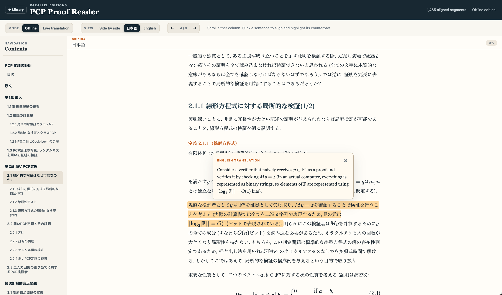

# Parallel Book Viewer

A lightweight local reader for studying sentence-aligned source documents and translations side by side or one language at a time.




## Install and run

Install [uv](https://docs.astral.sh/uv/), clone this repository, enter its root, and run:

```sh
uv run book-viewer-serve
```

Open `http://127.0.0.1:8000` in a browser.

When run from source, the app reads its library from the repository's `books/` directory. A standalone executable instead looks for `books/` beside the executable. Set `VIEWER_BOOKS_ROOT=/absolute/path/to/books` to use another location in either case.

Build the platform-specific standalone executable with:

```sh
scripts/build-binary.sh
```

The result is `dist/book-viewer`; book data remains external to the executable.

### Dependencies

- **Python 3.12 or newer and uv:** run the source server, install its small Python dependency set, and execute the book-building tools. Neither is required by the standalone executable.
- **Pandoc:** required only when building or rebuilding a book. It converts the paired Markdown editions to static HTML and produces syntax-highlighting tokens. It is not bundled with the standalone executable and is not needed to view an already-built book.
- **MathJax:** renders equations in the browser. The viewer loads it from a CDN by default; a local copy can be installed for offline use.
- **OpenAI-compatible Chat Completions service:** optional and used only for live translation.

## Add a book

Create a `books/` folder in the repository and put the PDF you want to read in it. Then point an AI agent at the repository and ask it to use the project skill at `.agent/skills/create-viewer-book` to convert the PDF into the format accepted by the viewer.

Except for the small tracked `books/example/` package, book source files, translations, metadata, generated browser data, and assets under `books/` remain local and are intentionally excluded from Git.

When using `book-viewer-serve`, the server discovers built books and creates the library catalog in memory for every catalog request. Refresh the library page after adding or rebuilding a book; restarting the server is unnecessary. The generated `books/catalog.js` file remains available for opening or hosting the static viewer without the Python server.

The reader stores each book's last-opened time and reading position in the browser's local storage. Recently opened books appear first in the library, and reopening a book resumes at its saved position. This history stays in the current browser profile and is not synchronized between browsers or devices.

## Live translation

Live translation requires an OpenAI-compatible Chat Completions service. Copy the example configuration:

```sh
cp .env.example .env
```

Set `LLM_CHAT_COMPLETIONS_URL` and `LLM_MODEL`; add `LLM_API_KEY` only when the provider requires it. Restart `book-viewer-serve` after changing the configuration. See [.env.example](.env.example) for the optional settings.

## Offline Math rendering

The viewer uses MathJax to render equations, which requires to connect to their CDN. If you want to use the viewer without internet, you can install a thin local MathJax runtime:

```sh
uv run book-viewer-install-mathjax
```

Run this before `scripts/build-binary.sh` to include MathJax in the standalone executable. The installed files under `vendor/mathjax/` are intentionally excluded from Git.
