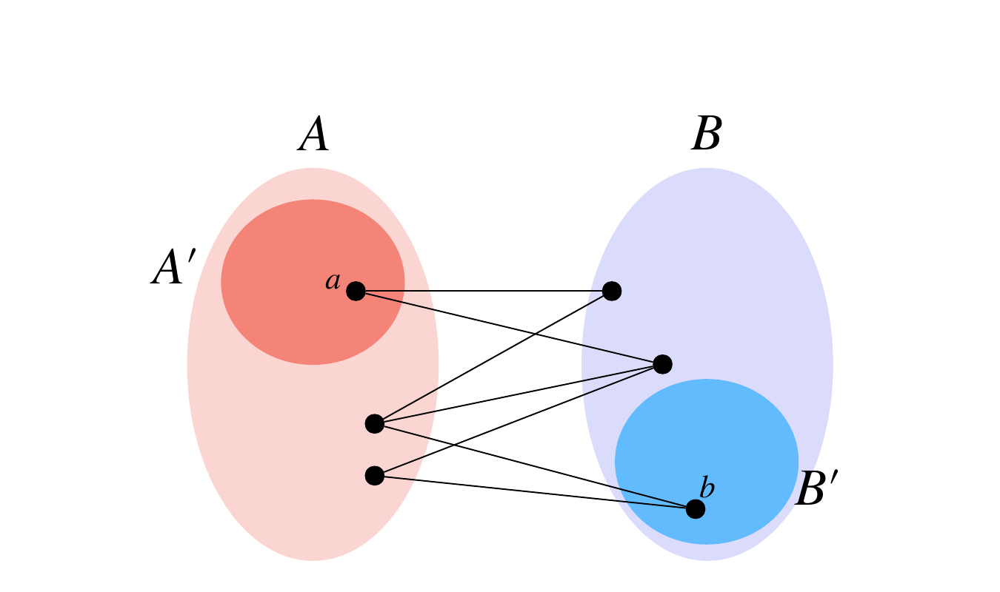

# Balog-Szemerédi-Gowers Theorem

清水 伸高*

April 29, 2022

## Abstract

アーベル群 $A,B$ から一つずつ要素を選んだ時の和を考える. この和のほとんどがある小さい集合に属する時に $A,B$ が満たす構造的性質を捉えたのが Balog-Szemerédi-Gowers の定理である. 本稿ではこの定理を紹介し証明する.

# 1 Balog-Szemerédi-Gowers Theorem (BSG Theorem)

アーベル群 $G$ の二つの部分集合 $A,B\subseteq G$ に対して $A+B:=\{a+b:a\in A,b\in B\}$ のサイズは一般に $|A||B|$ まで大きくなりうるが, どのような条件の下で小さくなるだろうか? 直感的には, $A+B$ が小さいということは $c\in A+B$ に対して $c=a+b$ を満たす $a\in A,b\in B$ の選び方がたくさんあれば $A+B$ は小さくなることが期待される. 即ち, 多くの組 $(a,b)\in A\times B$ に対しその和 $a+b$ がある小さい集合 $C\subseteq G$ に含まれているならば $|A+B|$ は小さくなるだろうか? 残念ながら反例が存在する.

例として $V\subseteq\mathbb{F}_2^n$ を $\dim V=d$ なる部分空間, $R\subseteq\mathbb{F}_2^n$ を $2^d$ 個のランダムなベクトルからなる集合とし, $A=B=V\cup R$ とする. ランダムに $a\sim A,b\sim B$ をとってくると確率 $1/4$ で $a,b\in V$ となり, $a+b\in V$ である. つまり $(a,b)$ のうち $25\%$ はその和が $V$ に属する. 一方で $d$ が小さければ高確率で $V\cup R$ は次元 $2d$ の部分空間を張り, $|A+B|=|\operatorname{span}(V\cup R)|=2^{2d}=|A||B|$ となってしまう.

BSG 定理は同様の条件を満たす $A,B$ に対して密な部分集合 $A'\subseteq A,B'\subseteq B$ をうまく選んで $|A'+B'|$ を小さくできることを主張する. BSG 定理は Balog and Szemerédi [BS94] が最初に証明し, その後 Gowers [Gow98] によってより単純な証明が与えられた.

**Theorem 1.1 (BSG theorem [BS94; Gow98]).** $G$ をアーベル群とし, $A,B\subseteq G$ を $|A|=|B|=N$ とする. サイズ $|C|=cN$ のある $C\subseteq G$ が存在して $\Pr_{a\sim A,b\sim B}[a+b\in C]\geq\epsilon$ を満たすとする. この時, $|A'|,|B'|\geq(\epsilon^2/16)N$ を満たすある $A'\subseteq A,B'\subseteq B$ が存在して $|A'+B'|\leq 2^{12}c^3(1/\epsilon)^5N$ を満たす.

本稿では Sudakov, Szemerédi, and Vu [SSV05] による証明を紹介する. Lovett [Lov17] のサーベイ論文でも同じ証明が紹介されているが, 本稿の証明では以下で示す逆マルコフの不等式などを用いて行間を小さくしている.

# 2 準備

有限集合 $S$ 上一様ランダムに要素 $x$ が選ばれるとき, $x\sim S$ と表す.

有限集合 $V$ と $E\subseteq\binom{V}{2}$ に対して $G=(V,E)$ をグラフという. $V$ を頂点集合と呼び, その要素を頂点と呼ぶ. $E$ を辺集合と呼び, その要素を辺と呼ぶ. 二つの頂点 $u,v\in V$ は $\{u,v\}\in E$ を満たすとき, 隣接しているという. しばしば辺 $\{u,v\}$ を $uv$ と略記する. 頂点 $v$ に対し, $v$ と隣接する頂点の集合を $N(v)$ で表し, その要素数を次数と呼び $\deg(v)$ と表す. すなわち $N(v)=\{u\in V:uv\in E\}$ 及び $\deg(v)=|N(v)|$ である.

* Tokyo Institute of Technology Email: shimizu.n.ah@m.titech.ac.jp

頂点列 $(v_1,\ldots,v_k)$ であって全ての $i\in\{1,\ldots,k-1\}$ に対し $v_iv_{i+1}\in E$ を満たすものをウォーク (または路) と呼び, 始点 $v_1$ と終点 $v_k$ を指定する場合は $v_1v_k$-ウォークと呼ぶ. ウォーク $(v_1,\ldots,v_k)$ の長さを $k-1$ で定義する. 特に全ての $v_1,\ldots,v_k$ が相異なるときはパスと呼ぶ. $v_1=v_k$ を満たすウォークを閉じたウォークといい, $v_1,\ldots,v_{k-1}$ が相異なる閉じたウォークを閉路 (またはサイクル) と呼ぶ. 二つの有限集合 $A,B$ 及び $E\subseteq A\times B$ の三つ組 $(A,B,E)$ を二部グラフと呼ぶ. 二部グラフはグラフ $(A\cup B,E)$ と同一視することによって $N(v)$ やウォークなどを定義する.

**Lemma 2.1 (Markov の不等式).** 非負値をとる確率変数 $X$ が $\mathbb{E}[X]<\infty$ であるとき, 任意の $a>0$ に対し $\Pr[X\geq a]\leq\mathbb{E}[X]/a$.

**Lemma 2.2 (逆 Markov の不等式).** $[0,1]$ に値をとる確率変数を $X$ とし, $\mu:=\mathbb{E}[X]\in(0,1)$ とする. このとき, $\Pr[X\geq\mu/2]\geq\mu/2$ が成り立つ.

*Proof.* Markov の不等式より, 任意の $c\in(0,1)$ に対して

$$
\begin{aligned}
\Pr[X\leq c]
  &=\Pr[1-X\geq1-c]\\
  &\leq\frac{1-\mu}{1-c}\\
  &=1-\frac{\mu-c}{1-c}\\
  &\leq1-(\mu-c).
\end{aligned}
$$

$c=\mu/2$ を代入すればよい.

**Lemma 2.3.** グラフ $G=(V,E)$ とパラメータ $c$ に対し, $H=\{v\in V:\deg(v)\geq c\}$ 及び $L=V\setminus H$ とする. このとき, $|H|\leq 2|E|/c$ および $|L|=|V|-|H|\geq|V|-2|E|/c$ が成り立つ.

*Proof.* ランダムな頂点 $v\sim V$ に対し $\mathbb{E}[\deg(v)]=2|E|/|V|$ である. Markov の不等式 (Lemma 2.1) より $|H|/|V|=\Pr[\deg(v)\geq c]\leq 2|E|/(c|V|)$ を得る.

# 3 証明

まずグラフに関する以下の補題を証明する.

**Lemma 3.1 ([SSV05]).** $H=(A,B,E)$ を二部グラフで $|A|=|B|=N$, 辺集合 $E\subseteq A\times B$ が $|E|=\epsilon N^2$ を満たすとする. このとき, $|A'|,|B'|\geq(\epsilon^2/16)N$ を満たすある $A'\subseteq A,B'\subseteq B$ であって, 任意の $a\in A',b\in B'$ に対して長さ $3$ の $ab$-パスが $2^{-12}\epsilon^5N^2$ 本以上存在する.

*Proof.* まず $B$ の頂点のうち次数 $\epsilon N/2$ 未満のものを全て除去する. このとき, $B$ には $\epsilon N/2$ 個以上の頂点が残る. 実際, $S=\{v\in B:\deg(v)\geq\epsilon N/2\}$ とすると

$$
\epsilon N^2=|E|
=\sum_{v\in S}\deg(v)+\sum_{v\in B\setminus S}\deg(v)
\leq N\cdot|S|+\frac{\epsilon N}{2}\cdot N
$$

から $|S|\geq\epsilon N/2$ を得る.

除去後のグラフを改めて $H=(A,B,E)$ と置き換えて証明する. このとき $|E|\geq(\epsilon/2)N^2$ である. 実際, 次数高々 $\epsilon N/2$ の頂点を高々 $N$ 個除去しているので, 除去される辺数は $(\epsilon/2)N^2$ である.

二つの頂点 $b,b'\in B$ が $|N(b)\cap N(b')|<(\epsilon^3/128)N$ を満たすとき, bad であると呼ぶ. 即ち, $(b,b')$ が bad であるとは $H$ において長さ $2$ の $bb'$-パスが少ないことを意味する.

Figure 1: Lemma 3.1 の図示. 多くの長さ $3$ の $ab$ パスが存在するが, 途中で経由する頂点は必ずしも $A',B'$ に属するとは限らない.

頂点 $v\in A$ に対してグラフ $G_v=(N(v),E_v)$ を, bad な頂点組 $b,b'\in N(v)$ に対して辺を引くことで得られるグラフとする. つまり $E_v=\{\{b,b'\}\subseteq N(v):(b,b')\text{ is bad}\}$ である. ランダムな $v\sim A$ に対する $G_v$ を考える. 頂点数の期待値は $\mathbb{E}[|N(v)|]=|E|/|A|\geq(\epsilon/2)N$ である. 固定した bad の組 $(b,b')$ に対し, $\Pr[b,b'\in N(v)]=\Pr[v\in N(b)\cap N(b')]=|N(b)\cap N(b')|/N\leq\epsilon^3/128$ であるので, $\mathbb{E}[|E_v|]=\sum_{\{b,b'\}:\,\mathrm{bad}}\Pr[\{b,b'\}\in E_v]\leq(\epsilon^3/256)N^2$ を得る.

$B_v'\subseteq N(v)$ を, $G_v$ において次数が $(\epsilon^2/32)N$ 以下であるような頂点の集合とすると, Lemma 2.3 より $\mathbb{E}[|B_v'|]\geq\mathbb{E}[|N(v)|]-2\mathbb{E}[|E_v|]/((\epsilon^2/32)N)\geq(\epsilon/4)N$ を得る. $\mathbb{E}_{v\sim A}[|B_v'|]\geq(\epsilon/4)N$ より, ある頂点 $v\in A$ が存在して $|B_v'|\geq(\epsilon/4)N$ となる. $B'$ をこの時の $B_v'$ とする. $A'=\{a\in A:|N(a)\cap B'|\geq(\epsilon^2/16)N\}$ とすると, $|A'|\geq(\epsilon^2/16)N$ である.

実際, $a\sim A$ に対して確率変数 $|N(a)\cap B'|$ を考えると, $|E(A,B')|\geq(\epsilon/4)N\cdot(\epsilon/2)N=(\epsilon^2/8)N^2$ より $\mathbb{E}[|N(a)\cap B'|]=|E(A,B')|/N\geq(\epsilon^2/8)N$ である. よって逆 Markov の不等式 (Lemma 2.2) から $|A'|/N=\Pr[|N(a)\cap B'|\geq(\epsilon^2/16)N]\geq\epsilon^2/16$ である.

最後に $(A',B')$ が所望の性質を満たすことを言えば良い. $a\in A',b\in B'$ を任意に固定し, 長さ $3$ の $ab$ パス $(a,b',a',b)$ の選び方を数える. 固定した $b\in B'$ の $G_v$ における次数の条件より bad な $(b,b')$ の取り方は高々 $(\epsilon^2/32)N$ 通りなので, これを $|N(a)\cap B'|$ から除くと, $(b,b')$ と bad にならないような $b'\in N(a)\cap B'$ は $(\epsilon^2/32)N$ 通りの選び方がある. 更に, $(b,b')$ は bad でないので長さ $2$ の $bb'$ パス $(b,a',b')$ が少なくとも $(\epsilon^3/128)N$ 通り存在する. 従って長さ $3$ の $ab$ パス $(a,b',a',b)$ は $(\epsilon^2/32)N\cdot(\epsilon^3/128)N=2^{-12}\epsilon^5N^2$ 通り存在する.

*Proof of Theorem 1.1.* $H=(A,B,E)$ を, $E=\{(a,b):a+b\in C\}$ で定まる二部グラフとする. 条件より $|E|\geq\epsilon N^2$ であり, Lemma 3.1 による頂点部分集合 $A'\subseteq A,B'\subseteq B$ を得る. この二つの部分集合に対して $|A'+B'|\leq2^{12}c^3(1/\epsilon)^5N$ を示せばよい.

$y=a+b\in A'+B'$ を一つとり, 任意の長さ $3$ のパス $(a,b',a',b)$ を考える. $H$ の構成より $a+b',b'+a',a'+b\in C$ で, しかも $y=(a+b')-(a'+b')+(a'+b)$ と表せる. このようなパスは $2^{-12}\epsilon^5N^2$ 本以上存在するため, 集合 $D_y:=\{(x,x',x'')\in C^3:y=x-x'+x''\}$ を考えると $|D_y|\geq2^{-12}\epsilon^5N^2$ である. 一方で任意の $y\in A'+B'$ に対し $D_y\subseteq C^3$ より $|D_y|\leq c^3N^3$ である. さらに相異なる $y\neq y'$ に対し $D_y\cap D_{y'}=\varnothing$ より,

$$
|A'+B'|\cdot2^{-12}\epsilon^5N^2
\leq\left|\bigcup_{y\in A'+B'}D_y\right|
\leq|C^3|
\leq c^3N^3
$$

を解いて $|A'+B'|\leq2^{12}c^3(1/\epsilon)^5N$ を得る.

# References

[BS94] Antal Balog and Endre Szemerédi. “A statistical theorem of set addition”. In: *Combinatorica* 14 (3 1994), pp. 263-268. URL: https://link.springer.com/article/10.1007/BF01212974.

[Gow98] W. T. Gowers. “A New Proof of Szemerédi’s Theorem for Arithmetic Progressions of Length Four”. In: *Geometric And Functional Analysis* 8 (3 1998), pp. 529-551. URL: https://link.springer.com/article/10.1007/s000390050065.

[Lov17] Shachar Lovett. “Additive Combinatorics and its Applications in Theoretical Computer Science”. In: *Theory of Computing* 1 (1 2017), pp. 1-55. URL: https://theoryofcomputing.org/articles/gs008/.

[SSV05] B. Sudakov, E. Szemerédi, and V. H. Vu. “On a question of Erdős and Moser”. In: *Duke Mathematical Journal* 129 (1 2005).
